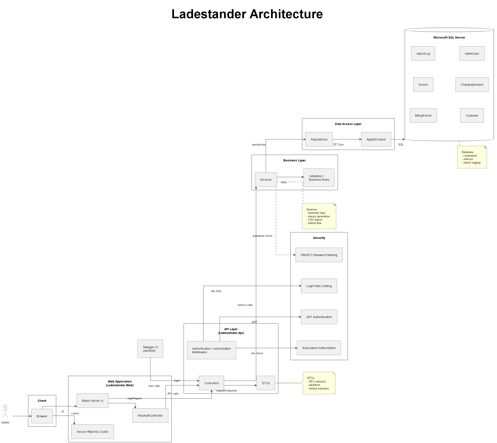

# Ladestander

Ladestander is a secure web application for managing electric vehicle charging data and invoice generation in a shared housing community.

The system was developed as part of a software development exam project focused on:

- Secure Software Development
- Software Quality
- Testability
- Secure by Design
- White-box Testing
- Layered Architecture

The project replaces a previous Microsoft Access-based workflow with a modern web architecture built with ASP.NET Core, Blazor Server, Microsoft SQL Server, JWT authentication, and a structured service/repository architecture.

The application supports:

- customer management
- billing period management
- charging session import
- CSV import from ChargerSync
- invoice generation
- invoice status management
- secure admin authentication
- audit-oriented import logging

The system is intentionally designed as a realistic MVP (Minimum Viable Product), where the primary focus is correctness, maintainability, security, and testability rather than full production-scale functionality.

## Features

### Backend

- Layered ASP.NET Core API architecture
- Service and repository pattern
- Dependency injection throughout the application
- DTO-based request/response handling
- Microsoft SQL Server database integration with Entity Framework Core
- JWT-based authentication and authorization
- PBKDF2 password hashing
- Rate limiting on login endpoint
- Structured exception handling and validation
- Import logging for CSV imports

### Frontend

- Blazor Server-based admin interface
- Secure cookie-based web authentication
- Server-side JWT handling
- Customer management
- Billing period management
- Charging session management
- Invoice generation and status updates
- CSV import interface for ChargerSync exports
- Danish admin interface for operational usage

### Security

- JWT authentication
- Role-based authorization
- HttpOnly Secure cookies
- Input validation
- DTO separation from entities
- Defense in depth principles
- Secure secret handling
- Removal of secrets from Git history
- Duplicate protection for charging session imports

### Software Quality

- Unit testing with xUnit
- Mock-based service testing with Moq
- SQLite in-memory repository integration testing
- White-box testing techniques
- Code coverage analysis
- Cyclomatic complexity analysis
- DD-path analysis
- Focus on testability and separation of concerns

## Architecture



The solution is structured as a layered ASP.NET Core application with clear separation of responsibilities between presentation, business logic, security, and data access.

The backend follows a service/repository architecture focused on:

- maintainability
- loose coupling
- testability
- separation of concerns

The system is divided into:

### Backend (`Ladestander.Api`)

- Controllers handle HTTP requests and responses
- Services contain business rules and orchestration
- Repositories handle database access
- DTOs isolate API contracts from database entities
- Security components handle authentication, authorization, and password hashing
- Validation components enforce business and input rules

### Frontend (`Ladestander.Web`)

The web application is implemented as a Blazor Server application.

Authentication is handled through a secure hybrid flow:

1. The browser submits login credentials to the web application
2. The web application authenticates against the API
3. The API returns a JWT token
4. The web application creates a secure HttpOnly cookie session
5. The JWT is stored server-side as a claim and used for authenticated API requests

This design avoids storing JWT tokens in browser localStorage or sessionStorage.

### Database

The system uses Microsoft SQL Server with Entity Framework Core.

The domain model is centered around:

- Customers
- BillingPeriods
- ChargingSessions
- Invoices
- AdminUsers
- ImportLogs

The database design includes:

- foreign key constraints
- unique constraints
- duplicate protection
- normalized entity relationships

The project originally migrated data from an existing Microsoft Access solution to Microsoft SQL Server.

## Security

Security was a core focus throughout the project and was treated as part of the system architecture rather than an isolated feature.

The project applies several secure-by-design principles, including:

- least privilege
- separation of concerns
- defense in depth
- controlled access to sensitive data
- secure handling of authentication tokens and secrets

### Authentication and Authorization

The API is protected using JWT-based authentication with role-based authorization.

The web application uses a secure cookie-based authentication flow:

- the browser never stores JWT tokens directly
- JWT tokens are handled server-side by the web application
- authentication cookies are configured as:
  - HttpOnly
  - Secure
  - SameSite=Strict

Administrative endpoints require authenticated users with the `Admin` role.

### Password Security

The original prototype used SHA256 hashing during early development.

The system was later upgraded to PBKDF2-based password hashing using ASP.NET Core Identity PasswordHasher in order to provide:

- salted password hashing
- stronger resistance against brute-force attacks
- modern password security practices

### Input Validation and Business Rules

Validation is enforced at multiple layers:

- DTO validation
- service-layer business validation
- database constraints

Examples include:

- prevention of duplicate charging sessions
- blocking invoice generation for closed billing periods
- validation of invoice status transitions
- validation of imported CSV data

### Rate Limiting

The login endpoint is protected using fixed-window rate limiting in order to reduce brute-force attack risks.

### Secure Repository Publishing

Before making the repository public:

- development secrets were removed from source control
- Git history was rewritten to remove old secrets
- local configuration files were excluded using `.gitignore`
- placeholder secrets were introduced for public-safe configuration

This process was intentionally documented and treated as part of the secure development lifecycle.

## Software Quality

The project was developed with a strong focus on testability, maintainability, and structured quality assurance.

A major goal of the project was to design a realistic business application where core functionality could be tested independently from the UI and infrastructure layers.

### Testability

The architecture was intentionally designed to support isolated testing through:

- layered architecture
- dependency injection
- loose coupling through interfaces
- separation between services and repositories
- DTO-based contracts

Business logic is primarily placed in service classes in order to make critical rules testable without requiring HTTP or UI integration.

### Unit Testing

The project uses xUnit for unit testing and Moq for dependency mocking.

Unit tests focus primarily on:

- business rules
- validation logic
- invoice calculation
- authentication logic
- service orchestration

Examples include:

- invoice generation rules
- invoice status transitions
- billing period restrictions
- duplicate charging session prevention
- authentication validation

### Repository Integration Testing

Repository tests use SQLite in-memory databases instead of EF Core InMemory.

This decision was made intentionally in order to test:

- relational database behavior
- foreign key constraints
- realistic query execution
- entity relationships

This approach helped expose issues that would not have been detected using the EF Core InMemory provider alone.

### White-Box Testing

The project includes practical use of several white-box testing techniques, including:

- statement coverage
- branch/decision coverage
- path testing
- condition testing
- exception path testing
- loop testing
- data flow testing
- boundary value thinking
- DD-path analysis
- cyclomatic complexity analysis

Critical business methods were analyzed using control-flow reasoning and path analysis in order to identify important execution paths and edge cases.

### Code Coverage

Code coverage analysis was used as a supporting quality metric rather than a goal in itself.

Coverage analysis was primarily used to:

- identify untested critical logic
- validate important business flows
- improve confidence in core services

The project intentionally prioritizes meaningful testing of business-critical logic over artificially maximizing total coverage percentages.

## Test Strategy

The testing strategy focuses on validating business-critical functionality at the service and repository layers rather than relying primarily on end-to-end or UI testing.

The goal was to create a system where core logic could be tested deterministically and independently from external infrastructure.

### Service Layer Testing

Service-layer unit tests validate business logic in isolation.

Dependencies such as repositories and security services are mocked using Moq in order to isolate the behavior of the service under test.

Examples of tested scenarios include:

- generating invoices
- validating billing periods
- preventing invalid invoice transitions
- handling duplicate charging sessions
- validating authentication flows

### Repository Testing

Repository integration tests use SQLite in-memory databases in order to test realistic relational database behavior.

These tests validate:

- entity persistence
- query correctness
- relationship handling
- foreign key constraints
- update behavior

Using SQLite instead of EF Core InMemory helped expose real relational database issues during development.

### Security Testing

Authentication and password security components are covered through dedicated tests for:

- JWT token generation
- JWT claims validation
- invalid authentication attempts
- PBKDF2 password verification
- password hash uniqueness caused by salting

### CSV Import Testing

The CSV import flow was treated as business-critical and includes tests for:

- delimiter handling
- reordered columns
- malformed rows
- duplicate detection
- customer matching
- import validation
- import restrictions for closed billing periods

The CSV parser was refactored from position-based parsing to header-based parsing in order to improve robustness and maintainability.

### Quality Focus

The project intentionally prioritizes:

- correctness of business logic
- realistic test isolation
- maintainable architecture
- deterministic testing
- meaningful coverage

over superficial test quantity or artificially inflated coverage metrics.

## Technology Stack

### Backend

- ASP.NET Core (.NET 10)
- Entity Framework Core
- Microsoft SQL Server
- JWT Authentication
- ASP.NET Core Rate Limiting
- PBKDF2 Password Hashing

### Frontend

- Blazor Server
- Razor Components
- Cookie-based Authentication

### Testing

- xUnit
- Moq
- SQLite in-memory
- Coverlet
- ReportGenerator

### Development Tools

- Visual Studio
- SQL Server Management Studio
- Git and GitHub
- Microsoft SQL Server Migration Assistant for Access

### Data Sources

- ChargerSync CSV exports
- Legacy Microsoft Access database

## Project Structure

```text
Ladestander
│
├── Ladestander.Api
│   ├── Common
│   ├── Controllers
│   ├── Data
│   ├── DTOs
│   ├── Entities
│   ├── Mapping
│   ├── Repositories
│   ├── Security
│   ├── Services
│   └── Validation
│
├── Ladestander.Web
│   ├── Components
│   │   ├── Layout
│   │   └── Pages
│   ├── Controllers
│   ├── DTOs
│   │   └── Auth
│   └── Helpers
│
└── Ladestander.Api.Tests
    ├── Repositories
    ├── Security
    ├── Services
    └── TestHelpers
```

## Database Design

The database design was migrated from an existing Microsoft Access solution to Microsoft SQL Server in order to support a more maintainable, scalable, and testable architecture.

The domain model is centered around the following core entities:

- Customer
- BillingPeriod
- ChargingSession
- Invoice
- AdminUser
- ImportLog

### Key Relationships

- An `Invoice` belongs to a `Customer`
- An `Invoice` belongs to a `BillingPeriod`
- A `ChargingSession` belongs to a `Customer`
- A `ChargingSession` belongs to a `BillingPeriod`
- A `ChargingSession` may optionally belong to an `Invoice`
- An `ImportLog` belongs to a `BillingPeriod`

### Database Constraints

The database includes several relational and business-oriented constraints in order to improve data consistency and protect against invalid operations.

Examples include:

- unique invoice constraint per customer and billing period
- duplicate protection for charging sessions
- foreign key constraints
- normalized entity relationships
- controlled delete behavior

### Historical Invoice Snapshot Strategy

Invoices store calculated totals such as:

- total energy consumption
- total invoice amount

This was intentionally designed as a snapshot strategy in order to preserve historical invoice consistency even if charging sessions or electricity prices change later.

### Import Logging

CSV imports are logged through the `ImportLog` entity, which stores:

- import timestamp
- billing period
- imported row count
- skipped row count
- import errors
- source filename

This supports operational traceability and debugging of import operations.

## Authentication Flow

The system uses a hybrid authentication architecture combining JWT authentication in the API with secure cookie-based authentication in the Blazor web application.

### Authentication Process

1. The administrator submits login credentials through the web application
2. The web application sends the credentials to the API
3. The API validates the credentials
4. The API generates a JWT token
5. The web application creates a secure HttpOnly cookie session
6. The JWT token is stored server-side as a claim
7. Authenticated API requests include the JWT token server-side

### Security Benefits

This approach was intentionally chosen in order to avoid exposing JWT tokens directly to browser JavaScript.

The browser never stores JWT tokens in:

- localStorage
- sessionStorage

Instead, the browser only receives a secure authentication cookie.

### Cookie Configuration

Authentication cookies are configured with:

- HttpOnly
- Secure
- SameSite=Strict
- fixed expiration time
- disabled sliding expiration

### Authorization

The API uses role-based authorization.

Administrative endpoints require authenticated users with the `Admin` role.

### Session Security

The current MVP implementation uses:

- fixed session lifetime
- secure cookie handling
- server-side JWT usage
- login rate limiting

More advanced session revocation and distributed session management were intentionally deferred as future improvements in order to keep the MVP scope realistic.

## CSV Import Flow

The system supports CSV import of charging session data exported from ChargerSync.

CSV import was treated as a critical business feature because imported charging data directly affects invoice generation and billing accuracy.

### Import Process

1. The administrator uploads a ChargerSync CSV export
2. The CSV parser validates and parses the file
3. Customers are matched against existing database records
4. Duplicate charging sessions are detected
5. Valid charging sessions are stored
6. Import results are logged in `ImportLog`

### Parser Design

The CSV parser was originally implemented using position-based column mapping.

This approach was later refactored to a header-based parser in order to improve:

- robustness
- maintainability
- tolerance for reordered columns

The parser supports multiple delimiters, including:

- semicolon (`;`)
- comma (`,`)
- tab (`\t`)

### Validation and Protection

The import flow includes protection against:

- duplicate charging sessions
- invalid billing periods
- imports into closed billing periods
- malformed CSV rows
- unmatched customers

### Username Normalization

Customer matching includes normalization logic in order to handle inconsistencies in ChargerSync exports, including:

- trailing numbers
- inconsistent spacing
- casing differences
- missing middle names

Imported charging sessions store normalized customer names rather than raw CSV usernames in order to improve long-term consistency of operational data.

## Running the Project

### Prerequisites

The project was developed using:

- .NET 10
- Microsoft SQL Server
- Visual Studio
- SQL Server Management Studio

### Local Database

The application expects a local SQL Server instance.

Example connection string:

```json
"Server=ALLANS_LAPTOP\\SQLEXPRESS;Database=LadestanderMigration;Trusted_Connection=True;TrustServerCertificate=True;"
```

### Configuration

The public repository uses placeholder secrets.

Before running the application locally, a local development secret must be configured in:

```text
Ladestander.Api/appsettings.Development.json
```

Example:

```json
{
  "JwtSettings": {
    "SecretKey": "YOUR_LOCAL_DEVELOPMENT_SECRET"
  }
}
```

### Starting the Solution

1. Open the solution in Visual Studio
2. Configure the Microsoft SQL Server connection
3. Configure the local JWT secret
4. Start both:
   - `Ladestander.Api`
   - `Ladestander.Web`
5. Open the frontend application
6. Log in using a configured admin user

### Default URLs

Frontend:

```text
https://localhost:7104
```

API Swagger UI:

```text
https://localhost:7013/swagger
```

### CSV Import

Charging session data can be imported through the admin frontend using ChargerSync CSV exports.

## Future Improvements

The current implementation is intentionally scoped as a maintainable MVP focused on security, maintainability, and testability.

Several future improvements were identified during development, including:

- customer self-service portal
- user-specific authorization
- PDF invoice generation
- email delivery
- automated charger API integration
- improved audit logging
- refresh tokens and session revocation
- broader rate limiting
- advanced reporting
- payment integration
- distributed session handling
- containerized deployment
- automated CI/CD pipelines

The project was intentionally designed with layered architecture and separation of concerns in order to support future expansion without major architectural redesign.

## Author

Developed by Allan Buhl Blindbæk as part of a software development exam project focused on:

- Secure Software Development
- Software Quality
- Secure by Design
- Testability
- White-box Testing
- Layered Architecture

ChatGPT was used as a development assistant for guidance, debugging, and documentation support.